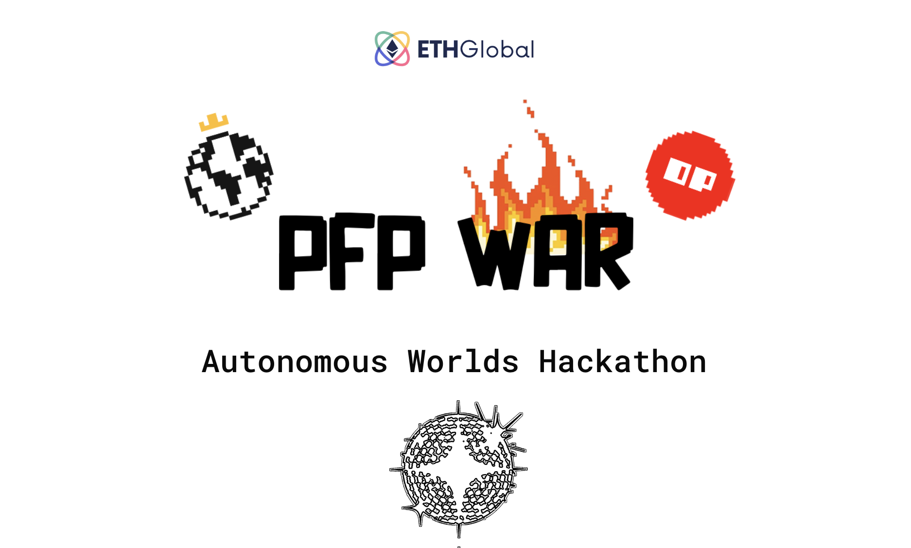

# PFP Pixel War

PFP Pixel War is a collaborative game where the players use NFTs they own on L1 Ethereum mainnet to use them in L2 (Optimism Rollup) via Storage proofs and MUD.
It's inspired from r/place by Reddit a 3.5-day experiment with 160 million pixel changes operated by over 10.5 million users,  at an average pace of about 2 million pixels placed per hour.



## Key Takeaways
* [Live demo](https://tranquil-malasada-165ce6.netlify.app/)
* [PFP WAR - ETH GLobal Official page](https://ethglobal.com/showcase/pfp-war-hccpt)
* [Medium Article About PFP WAR Storage Proof](https://medium.com/@vincentlg/pfp-war-project-use-the-l1-state-on-optimism-l2-with-storage-proof-fc0124db7caf)

## This project was build for ETHGLobal Autonomous world Hackathon

[ETHGLobal Autonomous world Hackathon Event](https://ethglobal.com/events/autonomous)

**Our interpretation of an Autonomous World**
  * Trustless
  * Collaborative and user generated
  * Real time
  * Our idea is easy to understand (simple showcase)
  * Builds on existing assets (NFTs)
  * Uses the network effect (target Web3 community who likes to flex their PFP)

**Technical motivations**
  * Challenge to prove the ownership of an L1 NFT on L2
  * Challenge to make this verifier a precompile in op-geth
  * Discovery and Stress test the MUD framework


## Storage Proof

**Objective**

Prove on a Layer 2 that Bob owns a NFT on Layer 1.

You can have a look to the [Pixel Wars Contracts README](https://github.com/cometh-game/pixel-war/blob/master/packages/contracts/README.md)

We wrote a detailed technical [article](https://medium.com/@vincentlg/pfp-war-project-use-the-l1-state-on-optimism-l2-with-storage-proof-fc0124db7caf) on how we did this.

## What have we done

### Ethereum Merkle Patricia Trie proof verifier:  

The Ethereum state is a data structure (a modified [Merkle Patricia Trie](https://ethereum.org/en/developers/docs/data-structures-and-encoding/patricia-merkle-trie/)) which keeps all accounts (nonce, balance, codeHash, storageRoot) linked by hashes and reducible to a single root hash stored on the blockchain.

Solidity ([contracts](https://github.com/cometh-game/pixel-war/tree/master/packages/contracts/src/libs))

### PFP War: A web game that uses our verifier:

MUD ([MUD client](https://github.com/cometh-game/pixel-war/tree/master/packages/contracts/src/libs))

### A op-geth precompile of this verifier: 

GO ([this repo](https://github.com/Kelvyne/op-geth/))

The verification of MPT is not available on EVM so we decided to make a precompile to simplify the verification of such trie on smartcontract.
The cost to call our precompile MPT verifier is 30K gas.

You can have a look to [the commit of our modification on op-get](https://github.com/Kelvyne/op-geth/commit/d1f21853b1e4548370c8bff9c9645415515b205d)


**core/vm/contracts.go**

We added a precompile to verify the MPT at address 0x92
```go
common.BytesToAddress([]byte{0x92}): &mptVerify{},

```

We need to format our data to make it compatible with the native Geth Method

```go
func (c *mptVerify) Run(input []byte) ([]byte, error) {
  // [root <32 bytes>, key <32 bytes>, proof <32 bytes length><n bytes arrays prefixed with length>]

  if len(input) < 96 {
    return nil, errMptVerifyInvalidInput
  }

  uint256Ty, _ := abi.NewType("uint256", "", nil)
  bytesArrTy, _ := abi.NewType("bytes[]", "", nil)

  arguments := abi.Arguments{
    abi.Argument{ Name: "root", Type: uint256Ty },
    abi.Argument{ Name: "key", Type: uint256Ty },
    abi.Argument{ Name: "proof", Type: bytesArrTy },
  }

  r, err := arguments.Unpack(input)
  if err != nil {
    return nil, errMptVerifyInvalidInput
  }

  root, _ := r[0].(*big.Int)
  key, _ := r[1].(*big.Int)
  proof, _ := r[2].([][]byte)

  proofKv := mappingKeyValue{}
  for _, step := range proof {
    hash := crypto.Keccak256(step)
    proofKv[string(hash)] = step
  }

  v, err := trie.VerifyProof(common.BigToHash(root), key.Bytes(), proofKv)
  if err != nil {
    return nil, errMptVerifyInvalidInput
  }

  var rlpDecoded []byte
  if err = rlp.DecodeBytes(v, &rlpDecoded); err != nil {
    return nil, err
  }
  return rlpDecoded, nil
}
```


## About the hackathon

**About Optimism and Storage proof**

The implementation of the Ethereum Merkle Patricia Trie was an interesting tech challenge. 
We deepened our understanding of EVM, precompiles and  how the state is stored.

**About MUD Framework**

Really simplifies the work on the front-end
Some issues with the public testnet indexer
Great support from the MUD team
Ultra-simplified smart-contract dev and management
Binding between UI and contract state is realy cool

**About EthGlobal**

Top organization and Guidance / Top ressources

**About life**

Keep learning, Keep building :D

## Run the project

`pnpm install`

`pnpm dev`


